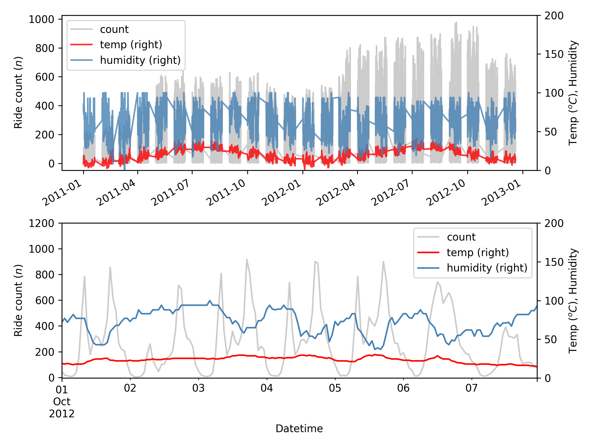
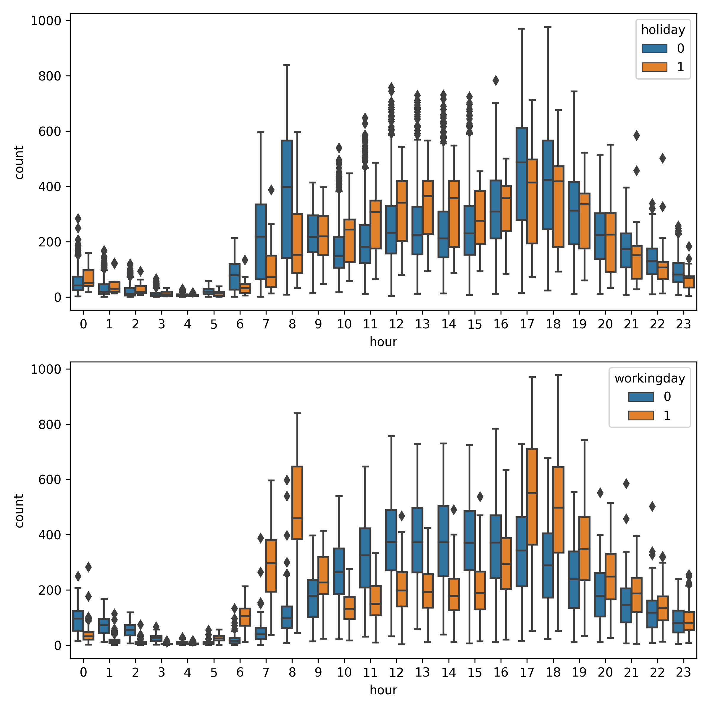
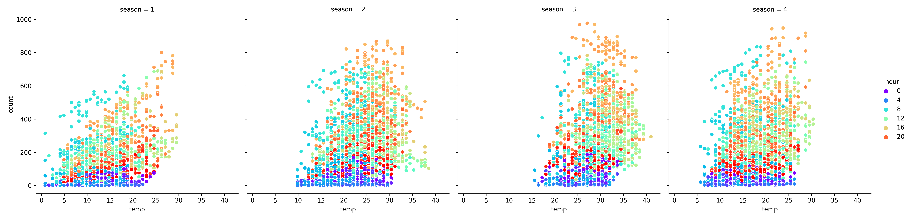
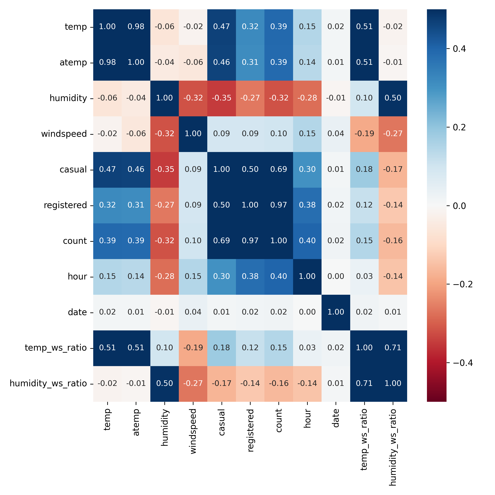
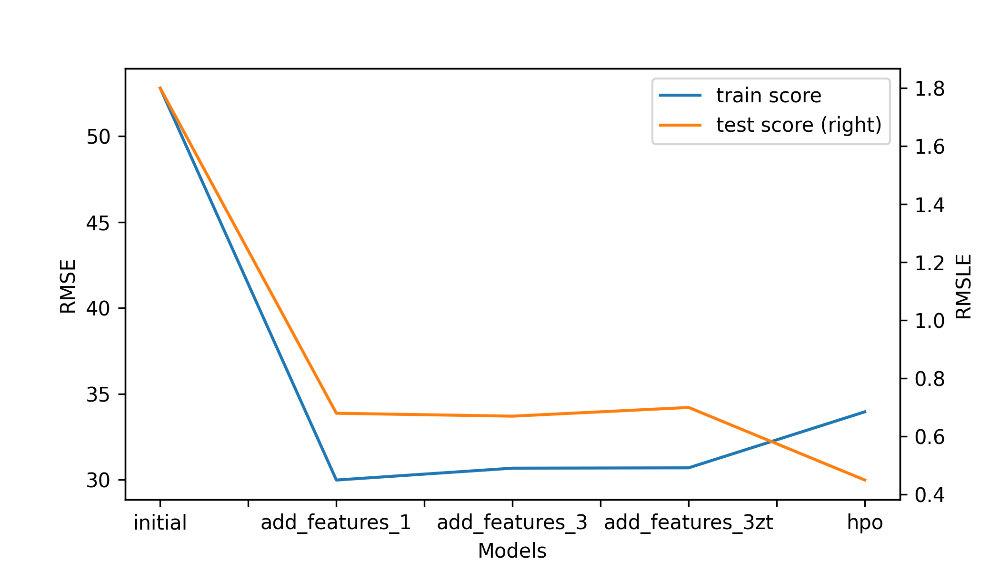

# Predict Bike Sharing Demand with AutoGluon
#### SACHI MISHRA

Accurate prediction of hourly bike rental counts has significant business value, leading to efficient logistical planning and better management decision-making for business operation. Here we use such a dataset from a Kaggle competition launched in May 2014. The dataset contains
- hourly bike rental counts,
- date and time information, and
- several environmental and weather information spanning two years.

Our goal here is to accurately predict hourly rental counts from the date-time and weather information using AutoGluon as our predictive model.

## Data
The dataset contains the following independent variables.
- datetime: Date and time information
- season – codes for four seasons (1: spring, 2: summer, 3: fall, 4: winter)
- holiday - whether the day is considered a holiday
- workingday - whether the day is neither a weekend nor holiday
- weather – codes representing 1: Clear, Few clouds, 2: Mist, Cloudy, Mist, 3: Light Snow, Light Rain, Thunderstorm, 4: Heavy Rain + Ice Pallets + Thunderstorm, Fog
- temp - the temperature in Celsius
- atemp - "feels like" temperature in Celsius
- humidity - relative humidity
- windspeed - wind speed
 
Response variable or target:
- count - number of total rentals

## Model Evaluation
We will use Root Mean Square Log Error (RMSLE) for model evaluation as the Kaggle competition requires that.

RMSLE = $\sqrt{\frac{1}{n}\sum_{i=1}^n (log(p_i + 1) - log(a_i + 1))^2}$

where:
+ $n$ is the number of hours in the test set 
+ $p_i$ is your predicted count
+ $a_i$ is the actual count
+ log(x) is the natural logarithm

However, we note that AutoGluon uses Root Mean Square Error (RMSE) for model ranking and selecting the best model.

RMSE = $\sqrt{\frac{1}{n}\sum_{i=1}^n (p_i-a_i)^2}$

## Initial Training
### What did you realize when you tried to submit your predictions? What changes were needed to the output of the predictor to submit your results?

AutoGluon model was trained using all available features and using the TabularPredictor module. WeightedEnsemble_L3 model was ranked as the top model with an RMSE of 52.80. As we are predicting number of hourly bike rentals, RMSE would be better served by converting it to an integer by rounding the real number (RMSE = 53). The submission file was prepared after checking for negative predictions and replacing them with zeros if there were any. However, there were no negative predictions from the model. Then the submission file was prepared only by keeping the datetime and predicted count column. The first submission resulted in an error as the submission file was not formatted adhering to the Kaggle rules and contained more columns than the competition expected.

### What was the top ranked model that performed?
WeightedEnsemble_L3 was top ranked model with the best Kaggle test score (RMSLE = 1.8).

## Exploratory data analysis and feature creation
### What did the exploratory analysis find and how did you add additional features?

The time series plot of the count data revealed interannual variability in the rental demand, with more numbers of bikes rented in the year 2012 than in 2011. As expected, bikers preferred biking in Spring and Summer seasons in both years. There are two daily peak demands – one in the morning around 7-8 am and the other in the afternoon around 5-6 pm during working days, most likely representing the demand from the office-goers (Fig. 1 and 2). Over holidays, there appears to be a demand for bike rentals around 11 am to 2 pm peaking at 12 pm - 1 pm, most likely showing the leisurely biking activity (Fig. 2, uppen panel). Thus, the very basic EDA highlights the strong dependence between the 'hour' of the day and the bike-sharing demand counts.

Figure 1. Bike-sharing demand time series spanning 2011-2012 in Washington, DC (upper panel); same data over the week of 10/01/2012 is provided for better visualization of hourly demands (lower panel)

Figure 2. Hourly bike rental demand during holidays and working and non-working days.

Figure 3. Relationship between air temperature and count. Color of the marker shows the hour of the day.

The hourly dependence is also visible in the air temperature-count relationship plot (Fig. 3). Count data from early morning hours (cooler colors) are stratified at the bottom showing the lowest demand and peak office morning hours (cyan color) and afternoon office return hours (orange color) showing the most demand irrespective of the season.

Figure 4. Correlation heat map (replace with map after adding features)

Based on insights from EDA, we added several new features. A complete list of added features is provided below.
- Hour
- Temp to windspeed ratio
- Humidity to windspeed ratio

Correlation analysis among all features and the target produced a few key insights.
1.	The bike rental count is positively correlated with temperature ($r$ = 0.39) and 'Feels-like' temperature (r=0.39), highlighting that bikers prefer warm temperatures.
2.	The bike rental count is negatively correlated with humidity ($r$ = -0.32). Bikers tend to prefer lower humidity hours/days for biking.
3.	However, when the data is sliced and analyzed by whether a day is a holiday or a working day, another critical insight emerges – for regular office goers, temperature and humidity are not essential factors for renting a bike or not (Analysis not shown).
4.	Windspeed appears to have no strong correlation with the count, as seen from the analysis in the bulk dataset (r=0.1).
5.	The hour of the day has stronger positive correlation with count ($r$ = 0.4)
6.	The two added features - temp to windspeed ratio ($r$ = 0.15) and humidity to windspeed ratio ($r$ = -0.16) showed positive and negative correlation with count, respectively.

### How much better did your model perform after adding additional features and why do you think that is?

Another AutoGluon model was trained using the previous features and the newly added 'hour' as the only feature. Performance of the newly trained model significantly improved (training RMSE = 29.99, test RMSLE = 0.68). The improved performance could be due to the addition of the hour variable as bike rental count strongly depends on the hour of the day. Similarly, the addition of 'temp to windspeed ratio' and 'humidity to windspeed ratio' increased the train error (RMSE = 30.68), but decreased the test RMSLE to 0.67. Further, we added more features such as 
 + 'month',
 + 'dow' - day of the week,
 + 'day',
 + 'holiday_rush_hour',
 + 'workday_rush_hour',
 + 'weekend_rush_hour', 
 + 'lets_bike', - a derived feature from holiday, workday, and weekend rush or peak hours 

through feature engineering. However, the RMSLE score in the train and test data drastically increased to , highlighting worse performance (test RMSLE = 0.72). Therefore, we decided to keep 'hour,' 'temp to windspeed ratio,' and 'humidity to windspeed ratio' as the only added features in the final model.

We also tested if standardization of data by scaling the numeric features using Z-transform would imprive preictive power of the model. However, the data transformation did not improve the model performance; rather somewhat deteriorated the model performance (Table 1, Fig. 5).

## Hyper parameter tuning
### How much better did your model preform after trying different hyper parameters?

Hyperparameter tuning was carried out by specifying hyperparameters
and hyperparameter_tune_kwargs arguments. For neural network models, we set the number of epochs to 50. We chose the learning rate search space from 1e-4 to 1e-2 on a log scale. Three activation functions - relu', 'softrelu,' and 'tanh' were set as three tunable options.
 
For lightGBM gradient boosted trees, we set the number of boosting rounds to 100. The num_leaves parameter was searched in a search space from 26 to 66 with a default of 36. Hyperparameter tuning was carried out for one hour by setting the time_limit to 3600. We chose a validation fraction of 30% to improve the model's generalization ability.
 
The top model with tuned hyperparameters produced the best model performance highlighting the importance of model tuning. The RMSE in the training dataset was 33.96, which is higher than the best model before tuning. However, the RMSLE in the test dataset came down to 0.45, making it the model with the best performance in the test dataset. This could be because the tuned model has better generalization ability. The hpo model tuning used a higher val_frac (0.3) for tuning the hyperparameters. That may be how the model obtained the better generalization ability and why the model performed better in the test dataset. 

### If you were given more time with this dataset, where do you think you would spend more time?

Additional feature engineering with several rounds of trial and error could probably help improve the model. Additionally, training and testing of the top model from AutoGluon's ranked set of models and hyperparameter tuning specific to WeightedEnsemble_L3 model could improve the model performance. Similarly, splitting the training dataset into train and validation data and training the model on new train data, and testing on validation data could help produce a more robust and generalizable model. That way, only top models would be submitted to the competition, reducing the number of submission entries in the Kaggle competition.

### Create a table with the models you ran, the hyperparameters modified, and the kaggle score.

Table 1. Model parameters and their final test score as obtained through Kaggle submissions.

|model          |Run time (sec)|Val_frac|presets|score|
|--             |--      |--      |--          |--   |
|initial        |600     |0.1     |Best quality|1.80 |
add_features_1  |600     |0.1     |Best quality|0.68 |
add_features_3  |600     |0.1     |Best quality|0.67 |
add_features_3 (zt)|600     |0.1     |Best quality|0.70 |
hpo|            3600     |0.3     |Best quality|0.45 |

### Create a line plot showing the top model score for the three (or more) training runs during the project.

Figure 5. Model performance scores from five trained models. RMSE and RMSLE represent the model error from training and testing stage. Refer to note under Table 1 for model explanation.

### Create a line plot showing the top kaggle score for the three (or more) prediction submissions during the project.

## Summary
This exercise used the bike-sharing demand dataset from the Kaggle competition and attempted to predict hourly bike rental demand from the hour of the day and several weather variables. This analysis highlighted that 'hour' is an important variable with strong predictive power to model bike rental demand. Similarly, temperature and humidity are positively and negatively correlated with the bike rental count. Feature engineering is the most crucial step in ML model training workflow, and therefore it should require the utmost attention. Further, the tuning of hyperparameters of the model was essential, which considerably boosted the performance of the final chosen model. Finally, this ML modeling exercise demonstrated the power of AutoML pipelines – AutoGluon and underlined how we could train a model with a few lines of code and minimal input from the user and deliver a model with reasonable model performance.

